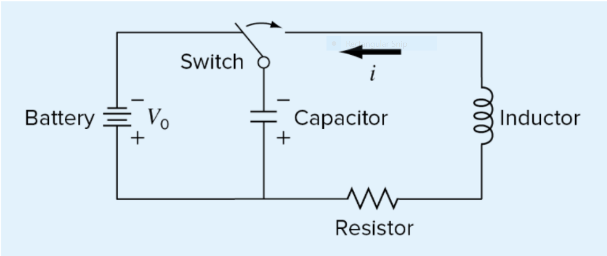
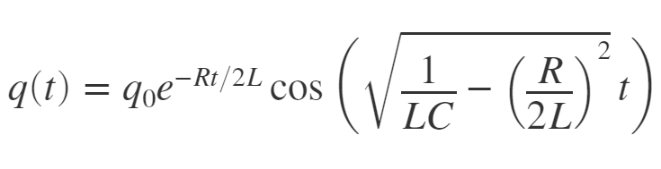

# Homework 02 - Problem 1 Info
---
Consider a simple electric circuit consisting of a resistor, a capacitor, and an inductor as shown below
  
The charge on the capacitor q(t) as a function of time can be computed as:  
  
Requirements:
1. Generate a plot of this function from t = 0 to 0.8 given, q0=10, R=60, L=9, and C=0.00005. 
2. Create another plot showing the function when the capacitor is 10x greater (C=0.0005).
3. Use the subplot function to display both plots side by side. Be sure to label your axis appropriately.
4. You must use the variables t, q, and q2 that are given in the template. These will be checked to make sure your script is correct, DO NOT rename them.

Note: DO NOT use "clear" in your function, it will break the grading scripts and your solutions will all be marked as wrong!
