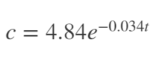

# Homework 02 - Problem 2 Info
---
The photodegradation of aqueous bromide for an particular setup is expected to follow the function:
  
where c is the concentration in ppm (parts per million), and t is the time in minutes.  

For the same setup, an experiment was run and the concentration was measured once every 10 minutes.

Requirements:
1. Create a plot displaying both the measured experimental data (using red diamond shapes) and the expected function (using a green dashed line). 
2. Plot the function for the first 70 minutes, using one point every 30 seconds (including the beggining and end point).
3. Be sure to include a lengend and label axes appropriately.

Note: DO NOT use "clear" in your function, it will break the grading scripts and your solutions will all be marked as wrong!
