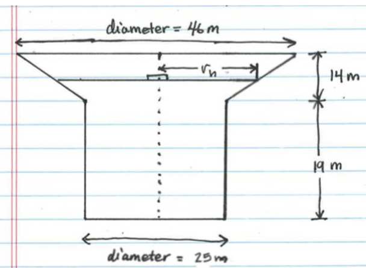

# Homework 03 - Problem 1 Info
---
The tank in a water tower has the geometry shown in the figure (the lower part is a cylinder and the upper part is an inverted frustum of a cone). Inside the tank there is a float that indicates the level of the water. Write a MATLAB program that determines the volume of the water in the tank from the position (height h) of the float. 

If you were doing this problem in real life, the program should ask the user to enter a value of h in m using the input() funtion.
  

Requirements: 
1. Solve for the volume when the height h = 20. Store the solution to the volume as variable v. Hint you will need to be able to calculate the volume of water in a cylinder and the volume of water in a cone.
2. Use fprintf to display the volume of water in cubic meters.
3. The program should detect non-sensical inputs (ie. h = 46m)

Note: DO NOT use "clear" in your function, it will break the grading scripts and your solutions will all be marked as wrong!
