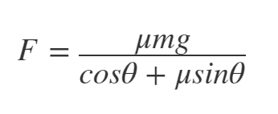
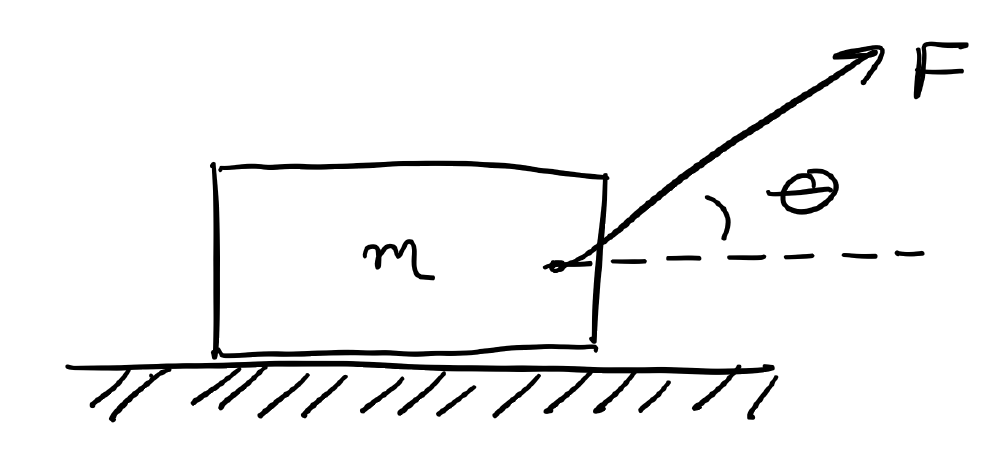

# Homework 11 - Problem 2 Info
---
Consider a box of mass m = 25 kg being pulled by a rope. The force required to move it is given by:  
  
  

Let: 
- μ = 0.55
- g = 9.81 m/s^2
    
Create a MATLAB script that solves for  in degrees when F = 150N. Your script should create a plot of a function that is dependent on theta.

Use the bisect function in your script file. It is included in Matlab Grader and can be called using  
`[root, fx, ea, iter] = bisect(func, xl, xu, es, maxit);`

Where the function inputs and outputs are the same as in the flase position algorithm.

Finally, your script should include a of fprintf statement(s) which should print out the the value selected as the root, how many iterations the method took, what the approximate error is and what f is evaluated at the root. Use the default values of the function when you can.

Note: You should change the format to long early in your script.
